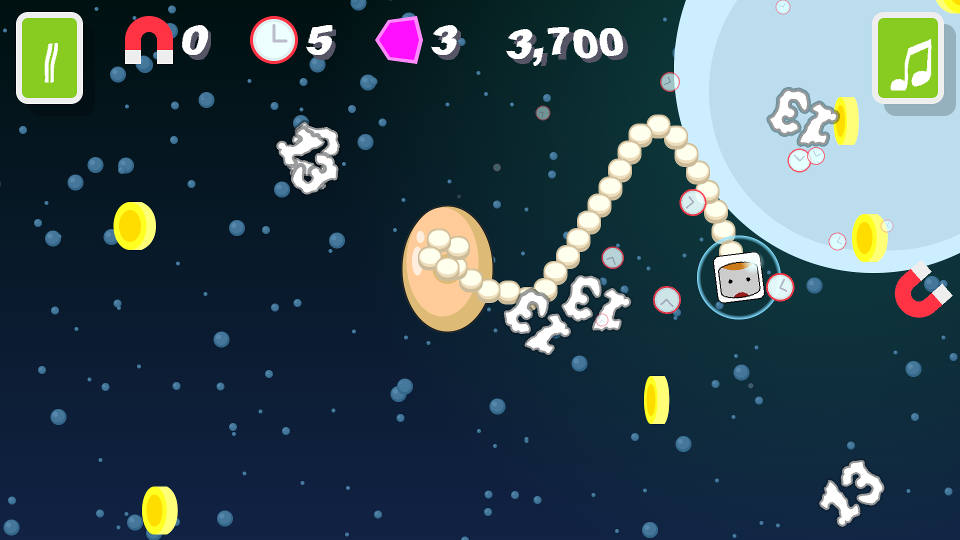

# Badluck Butter Chicken Goes To Outer Space

Badluck butter chicken goes to outer space is my second 2024 entry for the annual JS13k competition, where you have a calendar month to shoehorn an entire game into a 13Kb zip file.

The game should also follow a set theme and this year the theme is "Triskaidekaphobia", the fear or avoidance of the number 13.

The game play revolves around avoiding the thirteens and collect coins. It's a very simple mechanic for sure.

To spice things up a little bit you can collect several pickups; the shield that allows you for a time to deflect falling thirteens, the magnet which attracts coins towards you for a time, and the clock which slows the thirteens down for a while.

## Post-Mortem

Mostly this year has been about improving my engine and I feel that I've accomplished that.

After my first entry (Badluck butter chicken flies the ufriendly skies) I wondered what else I could accomplish with the engine in its current state and by reusing the assets created for the first entry.

I'm more than happy with the result. My first entry took a couple of weeks to complete, and this entry only took about four days.

I wonder how many low effort games I can shovel out next year.

### Graphics

I learned more about SVG imagery, especially when it comes to generating them with code.

Every year since I began using SVG graphics, I've been manually converting them into a code format that can be used with my custon SVG generation code. After creating the first entry I was starting to feel underwhelmed by having to do even more conversion.

So I took a little time out and created a converter, SVGWizard. All you need to do is paste your SVG image into it, and it will convert it into code usable by the engine. Man  should have done that years ago! Currently it only converts rects and paths but for now that's fine. Over the next few months I'll improve it to convert all of the different elements that the engine can use.

Next year I'll work on the partice system because I found myself wanting more and more to create new particle effects this year which the particle system can't visualize. Particles are high on the proirity list for next year.

### Audio

This year I wanted to add some music to my entry, which required a complete rewrite of my audio code. Having accomplished that now I have gained a better understanding of the mysterious `AudioContext` object.

I managed to fit three musical scores into my entry which I feel is quite an accomplishment, even though they are quite short.

The audio code is now a mutation of [ZzFXM](https://github.com/keithclark/ZzFXM), which also includes [ZzFX](https://github.com/.KilledByAPixel/ZzFX)

### UI and UX

This year I threw out pretty much all of the UI code from last year and opted to generate everything as HTML elements and inject them into the relevant containers.

I also added a lot of code to manage pausing and unpausing both the game and audio. Also, I added code that manages the cases where the user switches tabs or clicks out of the browser to another program, pausing and resuming the game and audio as required.

I think this will be the UI code going forward from this year on.

## Workflow

This year I tried out [js13k-pack](https://github.com/xem/js13k-pack) by xem to minify my code and pack it up into a zip file. It had some issues with my SVG filters and I didn't like how that the HTML code couldn't have scripts or CSS in it, requiring much effort to make it work.

I took all of the good parts from js13k-pack and created my own monstrosity called shrinkwrap.

Basically with shrinkwrap you paste your HTM code into it and it will extract embedded CSS and scripts for you, as well as load any linked CSS and scripts.

All other functionality remains the same, it just has a few more configurable options and IMHO looks a bit nicer.

## Pushing the Envelope

This year I really didn't push very hard at the 13Kb limit. This game comes in at a whopping 11,234 bytes, which is just over 2kb short of the limit!

Now that my engine is pretty much sorted I feel that next year I'll try and push the limit as far as I can.

## Conclusion

Last year I was going to work more on actual gameplay this year but that fell by the way as I wasn't totally happy with my engine. Next year will be gameplay year, I promise.

As always if you have any questions then raise a GitHub issue and I'll do my best to accomodate your requests :)

See you all next year!
